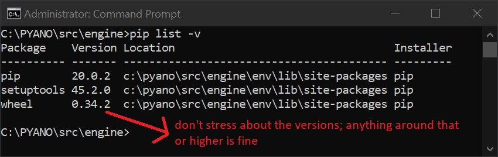
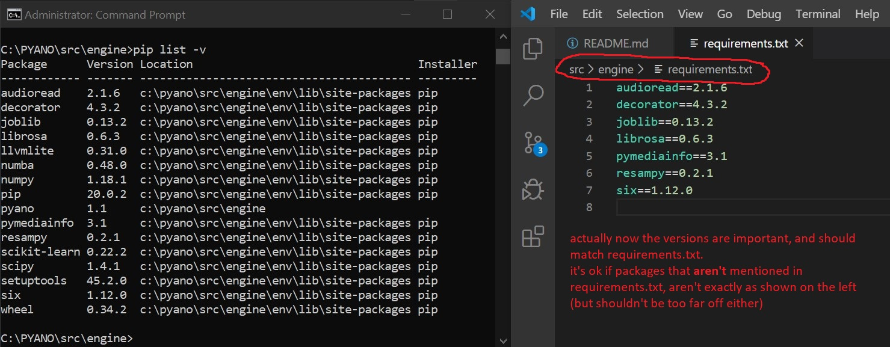

# Important: Always run terminal as Administrator (right click a program's icon -> run as admin)

You can also tick the following checkbox: right click cmd icon `-> Properties -> Shortcut -> Advanced -> Run As Administrator`.
# Pyano Installation

## Enable viewing hidden files on Windows Explorer
Main Explorer menu -> view -> check both "Hidden items" and "File name extensions"

## Install VSCode
https://code.visualstudio.com/download
Check all checkboxes during installation

## git
### Install
https://gitforwindows.org/    
When asked, select `Use visual studio code as git's default editor`.
Otherwise, just press "next".

### Set config
From terminal:
    
    git config --global user.email "idotavorslab@gmail.com"
    git config --global user.name "ITLab"
    
## Install nvm
https://github.com/coreybutler/nvm-windows/releases

Extract then install.

Check if installed: run
    
    nvm -v

Should see 

    Running version <whatever>

## Install node.js

    nvm install 13.5.0
Check if installed correctly:
    
    nvm list    
Should display `13.5.0`

## Clone Pyano
    cd C:\
    git clone https://github.com/idotavorslab/PYANO.git
    cd PYANO
This will take a while because of the piano samples (lots of audio files).

## Set local node version
From within `PYANO` root folder (that's `C:\PYANO`)
    
    nvm use 13.5.0
Should see `Now using node v13.5.0 (64-bit)`.

Check versions:

    node -v
Should see `v13.5.0`.

    npm -v
Should see `6.13.4`.

## Install Pyano
From within PYANO root folder:

    npm install --save-exact
This may take a while. Then run:

    git checkout node_modules/pyano_local_modules
Should see `Updated <around 40> paths from the index`

## Install Python (3.7.6)
https://www.python.org/downloads/release/python-376/

(specifically for windowsx64bit: https://www.python.org/ftp/python/3.7.6/python-3.7.6-amd64.exe)

Make sure to check `Add python to PATH` and press `Customize installation`. Next -> Tick all checkboxes -> Next -> ... -> until done.

### Check installation:
**Close and re-open terminal (as admin)**, then:
    
    python
Should see `>>> Python 3.7.6`. 

To exit press `Ctrl+Z` then `Enter`.

## Install virtualenv
    pip install virtualenv
Check if installed correctly:
    
    virtualenv --version
Should see: 
    
    virtualenv <whatver> from c:\program files\python37\lib\site-packages\virtualenv\__init__.py
(Or something similar)

## Install Pyano's python virtual environment
### Create virtualenv
    cd C:\PYANO\src\engine
    virtualenv env
Should see something like:

Then, run

    env\scripts\activate
Check if ok:

    pip list -v
Should see:

## Install requirements
Still from ***`C:\PYANO\src\engine`***:
### 1st step
    pip install -r requirements.txt
May take a while, get yourself a coffe. If it looks stuck after 5+ minutes, try pressing `Enter` to refresh the terminal GUI.

### 2nd step
    pip install -e .
   
### Now check:
    pip list -v
Should see:

## Install ffmpeg
https://ffmpeg.zeranoe.com/builds/win64/static/ffmpeg-4.2.2-win64-static.zip

If it's broken, then try:

https://ffmpeg.zeranoe.com/builds/

Create dir: `C:\ffmpeg`
Open the zip file you downloaded, double click the only dir, copy the content into `C:\ffmpeg`. 
Result:

# Running Pyano
    cd C:\PYANO
	npm start

# Troubleshooting
If Pyano seems stuck on launch, or loads only partially, quit Pyano.

## Check for missing files
In a new terminal, go to `C:\PYANO` and run:

    git status
If it looks like this:

run 

    git checkout node_modules/pyano_local_modules
then run `git status` again to check if the `deleted` files are back.

*Note*: don't worry about other files being `modified` or even `deleted`, especially config files or subject data. Just things under `node_modules` are important. 
## Check terminal

## Change to dev mode
Open DevTools via `Ctrl+Y` (if nothing happens, try alt-tabbing out and back in once to Pyano, then try `Ctrl+Y` again).

Shouldn't see any reds.
